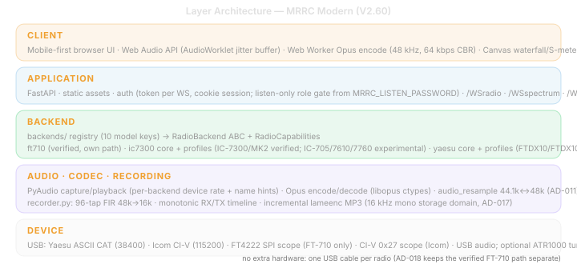

# 1. Executive Summary

## 1.1 Project Overview

MRRC Modern (`mrrc_modern`) is a mobile-first browser remote-control system for supported HF/50MHz transceivers — currently the Yaesu FT-710 and the Icom IC-7300 / IC-7300MK2. It provides a single web UI, WebSocket control/audio/spectrum channels, a pluggable radio-backend layer, spectrum data capture, PyAudio sound card audio streaming, Opus codec compression, and real-time waterfall/S-meter/multi-meter visualization.

The codebase is a standalone Python FastAPI/Uvicorn service. It does not depend on wfview, Hamlib, or any external radio middleware. The backend is selected at startup by `MRRC_RADIO_MODEL` (`ft710`, `ic7300`, or `ic7300mk2`; default `ft710`). Each backend talks directly to its radio: the FT-710 backend sends Yaesu ASCII CAT over a serial port and reads FT4222 SPI scope data via a subprocess; the IC-7300 backend sends Icom CI-V frames over USB serial and demuxes in-band 0x27 spectrum on the same port. RX/TX audio is captured/played through the radio's built-in USB audio interface via PyAudio.

## 1.2 Current Design Goals

| Goal | Target | Current Evidence |
| ------ | -------- | ------------------ |
| Mobile-first operation | iPhone/mobile browser as primary UI | `static/index.html`, `ft710.css`, `ft710_main.js`, `ft710_ui.js` |
| Full radio control | All essential radio commands via WebSocket | `backends/ft710/cat_controller.py`, `backends/ic7300/civ_controller.py` |
| Real-time spectrum | Waterfall from real scope data or S-meter fallback | `backends/ft710/scope_pipe.py`, `backends/ic7300/civ_scope.py`, `scope_handler.py` |
| Bidirectional audio | RX audio from radio to browser; TX audio from browser to radio | `audio_handler.py`, `/WSaudioRX`, `/WSaudioTX` |
| Safe PTT handling | Multiple layered safeguards against stuck TX | `ptt_manager.js` watchdog, dead-man switch, unload beacon |
| Minimal deployment | Single Python process serves UI, WS, audio, scope, radio bridge | `server.py` FastAPI lifespan |

## 1.3 Implemented Core Features

| Feature | Status | Description |
| --------- | -------- | ------------- |
| Mobile PWA-style UI | Implemented | Safe-area support, manifest, service worker, dark amber theme |
| Control WebSocket | Implemented | `/WSradio` JSON: fullState, stateUpdate, set/get commands, auth |
| RX audio WebSocket | Implemented | `/WSaudioRX` tagged dual-codec frames (0x00=PCM, 0x01=Opus 48kHz mono) |
| TX audio WebSocket | Implemented | `/WSaudioTX` tagged mic frames → Opus decode → PyAudio → radio |
| Spectrum WebSocket | Implemented | `/WSspectrum` binary: v1=851B wf1, v2=1701B wf1+wf2, ~30fps |
| Spectrum dual-mode | Implemented | Real FFT data (FT4222 SPI for FT-710, CI-V 0x27 for IC-7300) + S-meter fallback (synthetic Gaussian peaks) |
| Serial radio protocol | Implemented | FT-710: Yaesu ASCII CAT via pyserial; IC-7300: CI-V framing via `civ_codec.py`/`civ_controller.py` |
| 7-task polling | Implemented | 100ms–5s adaptive polling (7 asyncio tasks) with skip-on-command |
| S-meter + Multi-meter | Implemented | Canvas S-meter bar + PWR/ALC/SWR/Id/Vd horizontal bar meters |
| Memory channels | Implemented | `/api/mem_channels` GET/POST with `mem_channels.json` persistence |
| Session auth | Implemented | Password login, `ft710_auth` cookie (30-day), `?token=` on WebSocket |
| PTT safety | Implemented | Touch-and-hold TX; PTT watchdog; dead-man switch; unload beacon |

## 1.4 Architecture Layers

## 1.5 Current Project Status

As of 2026-08-17, the full control + spectrum + audio pipeline is implemented for both the FT-710 and IC-7300/MK2 backends. RX audio is captured from the selected radio's USB audio interface via PyAudio, encoded with Opus (48kHz mono), and streamed to the browser via `/WSaudioRX`. TX audio is captured from the browser microphone, encoded with Opus (or PCM fallback), decoded server-side, and played to the radio via PyAudio output; the FT-710 bridges the 48kHz codec domain to the radio's native 44.1kHz USB audio, while the IC-7300 uses 48kHz native USB audio with no resample. PTT triggers TX audio stream start/stop. Spectrum comes from the FT4222 SPI chip (FT-710) or CI-V 0x27 frames (IC-7300) when available, with automatic S-meter fallback. All radio controls (frequency, mode, filter, gains, PTT, NR/NB/AN, compressor, ATU, scope settings) are available through the WebSocket JSON API, with the frontend adapting to the active backend's `capabilities` in `fullState`.
