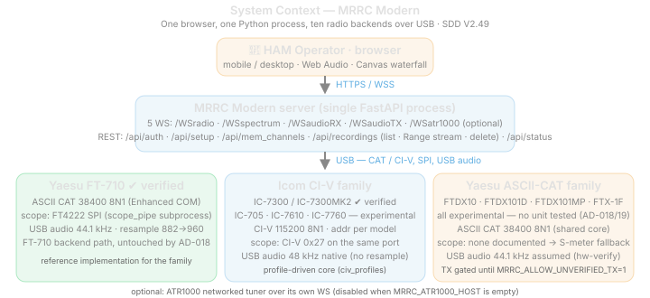

# 4. System Context (APP 011)

## 4.1 Context Diagram

## 4.2 Actors

| Actor | Role |
| ------- | ------ |
| HAM Operator | Uses browser UI to listen, tune, adjust settings, key PTT, monitor meters |
| System Maintainer | Starts/stops service, manages serial ports, checks logs |
| Yaesu FT-710 | External radio device controlled via serial CAT; provides scope data via FT4222 SPI; provides audio via USB sound card |
| Browser Runtime | Provides WebSocket, Web Audio, microphone, touch input, Canvas API |

## 4.3 External Interfaces

| Interface | Protocol | Endpoint | Direction | Description |
| ----------- | ---------- | ---------- | ----------- | ------------- |
| Static UI | HTTP | `/{path}` | Browser → Server | Serves `index.html`, CSS, JS, manifest, WASM |
| Control WS | WS | `/WSradio` | Browser ↔ Server | JSON commands and state updates |
| RX Audio WS | WS | `/WSaudioRX` | Server → Browser | Tagged dual-codec frames (Opus/PCM, 48kHz mono) |
| TX Audio WS | WS | `/WSaudioTX` | Browser → Server | Tagged mic frames (Opus/PCM) for radio TX |
| Spectrum WS | WS | `/WSspectrum` | Server → Browser | Binary spectrum frames (v1=851B, v2=1701B) |
| Memory API | HTTP | `/api/mem_channels` | Browser ↔ Server | Get/set memory channels |
| Status API | HTTP | `/api/status` | Browser → Server | Full radio state JSON |
| Auth API | HTTP | `/api/auth/login`, `/api/auth/logout`, `/api/auth/check` | Browser ↔ Server | Session management |
| CAT Serial | Serial | USB Enhanced COM Port | Server → Radio | Yaesu CAT commands (38400, 8N1) |
| FT4222 SPI | SPI | Internal FTDI chip | Radio → Server | 850-point FFT scope data via `scope_pipe.py` subprocess |
| USB Audio IN | Audio | USB Audio Device | Radio → Server | RX audio capture via PyAudio |
| USB Audio OUT | Audio | USB Audio Device | Server → Radio | TX audio playback via PyAudio |

## 4.4 Data Flows

| Flow | Description |
| ------ | ------------- |
| CAT control flow | UI action → `/WSradio` JSON → `CatController` serial command → radio response → `RadioState` update → broadcast |
| RX audio flow | FT-710 USB Audio → PyAudio capture (44.1kHz Int16) → resample to 48kHz → Opus encode → `/WSaudioRX` tagged frames → browser AudioWorklet playback |
| TX audio flow | Browser mic → getUserMedia (48kHz) → AudioWorklet → Opus encode (Worker) → `/WSaudioTX` tagged frames → Opus decode → resample 48→44.1k → PyAudio → FT-710 USB Audio |
| Spectrum flow (FT4222) | FT-710 → FT4222 SPI → `scope_pipe.py` subprocess → stdout pipe → `_read_scope_pipe()` → parse → `/WSspectrum` binary → browser waterfall |
| Spectrum flow (fallback) | CAT SM0; poll → `radio_state.s_meter` → `ScopeHandler.update_from_radio_state()` → synthetic Gaussian spectrum → `/WSspectrum` |
| State broadcast flow | Poll scheduler or user command → `RadioState.update()` → dirty-field tracking → `_broadcast_state()` → `/WSradio` stateUpdate |
| PTT safety flow | UI touch → `sendCommand('ptt', true)` → CAT `TX1;` → radio TX; release → `TX0;` (fire-and-forget) → watchdog |
| Polling flow | `PollScheduler` 7-task timer → CAT queries → response parse → `RadioState.update()` → broadcast if changed |

## 4.5 System Boundaries

| Boundary | Inside | Outside |
| ---------- | -------- | --------- |
| Browser boundary | UI state, audio playback, mic capture, PTT safety UX | Browser permission model and autoplay policy |
| Server boundary | WebSockets, static serving, CAT serial, FT4222 scope subprocess, PyAudio I/O, Opus codec, auth | Radio firmware, USB driver stack, OS audio subsystem |
| scope_pipe boundary | FT4222 SPI read loop, frame sync, diagnostics | FTDI D2XX driver, kernel VCP driver detach |
| Audio boundary | PyAudio stream management, Opus encode/decode, WS fan-out | USB audio device enumeration, sample rate negotiation |

## 4.6 Contextual Constraints

- FT-710 CAT requires the Enhanced COM Port (not Standard COM Port) at 38400 baud.
- FT4222 SPI requires D2XX driver with `DetachKernelDriver=1` to claim the device from macOS VCP.
- Only one process can access the FT4222 at a time — wfview or ExpertSDR must be closed.
- USB audio device naming varies by OS; PyAudio auto-detects "FT-710" or "YAESU" in device name.
- iOS Safari requires HTTPS for reliable `getUserMedia`; HTTP is acceptable for LAN/localhost use.
- Serial port path varies by OS: `/dev/cu.usbserial-*` (macOS), `/dev/ttyUSB*` (Linux), `COM*` (Windows).
