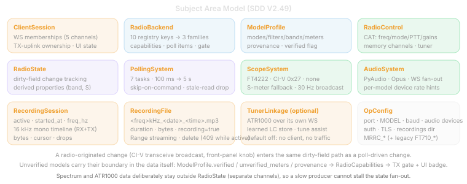

# 7. Subject Area Model (APP 408)

## 7.1 Subject Areas

## 7.2 Entity Definitions

| Entity | Attributes | Description |
| -------- | ------------ | ------------- |
| ClientSession | websocket, channel_type, connected_at | Runtime connection in `ctrl_clients`, `spectrum_clients`, `audio_rx_clients`, `audio_tx_clients` |
| RadioConnection | serial_port, baudrate, connected, model_id | CAT serial port state within `CatController` |
| RadioState | vfo_a_freq, vfo_b_freq, active_vfo, mode, tx_status, s_meter, af_gain, rf_gain, rf_power, filter_width, preamp, attenuator, noise_blanker, noise_reduction, auto_notch, compressor, compressor_level, nr_level, nb_level, tuner_status, power_on, squelch, mic_gain, split, vox, break_in, comp_meter, alc_meter, power_meter, swr_meter, id_meter, vd_meter, scope_span, scope_speed, scope_mode, scope_start_freq, serial_connected | Dataclass with dirty-field tracking |
| CatCommand | prefix, value, response | Serial CAT command: send `"FA014200000;"` → receive `"FA014200000;"` |
| ScopeFrame | wf1[850], wf2[850], s_meter, vfoa_freq, mode, scope_span, scope_mode, preamp, attenuator, scope_start_freq | Parsed from scope_pipe stdout payload |
| SpectrumFrame | version_byte, wf1_bytes[850], wf2_bytes[850] | Binary frame broadcast via `/WSspectrum` |
| AudioChunk | pcm_bytes, sample_count, timestamp | Raw Int16 PCM from PyAudio capture |
| AudioFrame | tag_byte, payload_bytes | Tagged dual-codec frame (0x00=PCM, 0x01=Opus) broadcast via `/WSaudioRX` |
| OpusEncoder | bitrate, frame_size, cap_bytes | Server-side libopus encoder via ctypes |
| OpusDecoder | sample_rate, channels | WASM Opus decoder in browser |
| PollTier | interval, commands, fields | One tier of the 7-task polling scheduler |
| MemoryChannel | index, frequency, mode, label | Memory record persisted in `mem_channels.json` |
| AuthToken | token_hex, created_at | 32-byte random hex session token |
| SCOPE_PIPE_Process | pid, stdout, stderr | Subprocess running `scope_pipe.py` for FT4222 SPI I/O |

## 7.3 Relationships

| Relationship | Cardinality | Description |
| -------------- | ------------- | ------------- |
| ClientSession → RadioState | N:1 | Multiple browsers see same state via broadcast |
| CatCommand → RadioState | 1:1 | Each CAT response updates one or more state fields |
| ScopeFrame → SpectrumFrame | 1:1 | Each parsed scope frame produces one spectrum frame |
| AudioChunk → AudioFrame | 1:N | One PCM chunk may produce multiple Opus frames (20ms boundaries) |
| RadioState → ClientSession | 1:N | Dirty-field state updates fan out to all ctrl_clients |
| PollTier → CatCommand | 1:N | Each tier sends multiple CAT queries per cycle |

## 7.4 State Ownership

| State | Owner | Persistence |
| ------- | ------- | ------------- |
| Connected WebSockets | `server.py` global sets | Runtime only |
| Radio state | `RadioState` dataclass | Runtime only |
| CAT connection | `CatController` instance | Runtime only |
| Scope data | `ScopeHandler` instance | Runtime only |
| Audio streams | `AudioHandler` instance | Runtime only |
| Poll schedule | `PollScheduler` instance | Runtime only |
| Memory channels | `/api/mem_channels` + `mem_channels.json` | Filesystem (JSON) |
| Auth tokens | `_auth_tokens` set | Runtime only (cleared on restart) |
| UI state | `radioState` object, DOM | Browser session/cookies |
| Waterfall pixels | Canvas image data | Browser runtime only |
