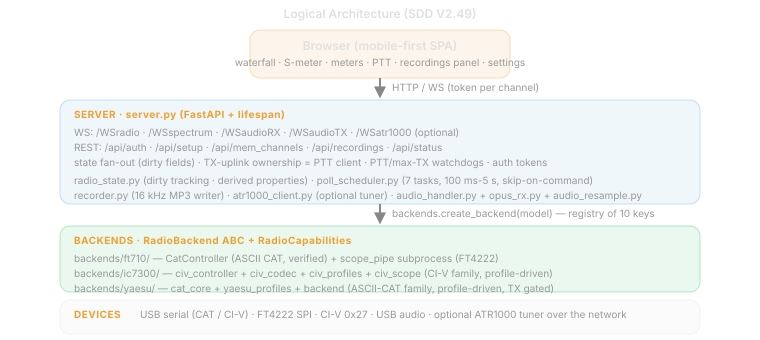
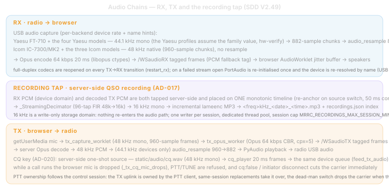
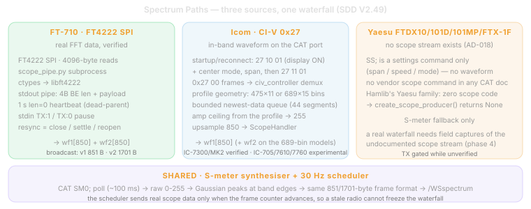
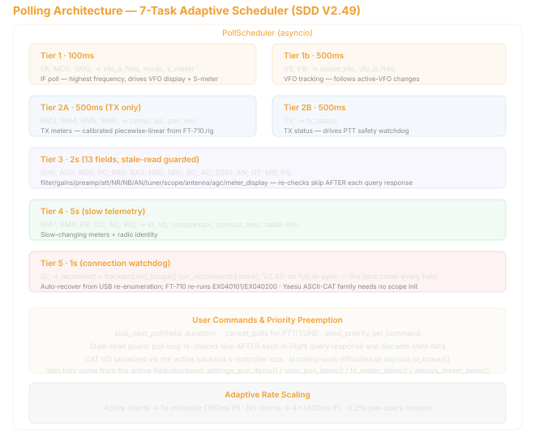
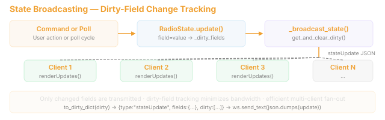
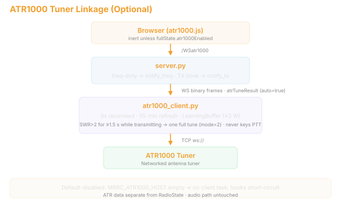

# 9. Architecture Overview (ART 0512)

## 9.1 Logical Architecture

## 9.2 WebSocket Endpoints

### 9.2.1 /WSradio (JSON text)

Control channel. Carries all radio commands, state updates, and memory management.

**Server → Client:**

- `{"type":"fullState","data":{...},"radioModel":"...","radioDisplayName":"...","capabilities":{...},"bands":[...],"modes":[...]}` — initial sync on connect; `capabilities` is backend-specific (bands, modes, filters, ATT/PRE steps, meter visibility, scope banner, etc.)
- `{"type":"stateUpdate","fields":{...},"dirty":[...]}` — partial changed-field update
- `{"type":"value","field":"...","value":...}` — single-value query response
- `{"type":"memChannels","channels":[...]}` — memory channel broadcast
- `{"type":"pong"}` — keepalive response

**Client → Server:**

- `{"type":"set","field":"...","value":...}` — command (40+ supported fields)
- `{"type":"get","field":"..."}` — query current value
- `{"type":"memSave","channels":[...]}` — save memory channels
- `{"type":"memDelete","index":N}` — delete memory slot
- `{"type":"ping"}` — keepalive

### 9.2.2 /WSaudioRX (binary)

**Format:** 1-byte codec tag (0x00=PCM, 0x01=Opus) + payload.

Server captures Int16 mono from the selected radio's USB audio (44.1kHz for FT-710, 48kHz for IC-7300/MK2) → resamples to 48kHz if needed → Opus encodes (64kbps default) → broadcasts to all `audio_rx_clients` at 20ms intervals. Browser decodes via WASM OpusDecoder (or Int16→Float32 for PCM) → AudioWorklet playback with jitter buffer.

### 9.2.3 /WSaudioTX (binary + text)

**Binary:** 1-byte codec tag + encoded mic audio. Server decodes (Opus→PCM or pass-through PCM) → queues to PyAudio output stream → played to the selected radio's USB audio input (44.1kHz for FT-710 with resample, 48kHz native for IC-7300/MK2).

**Text:** `"s:"` = stop TX; `"m:rate,encode,..."` = settings.

### 9.2.4 /WSspectrum (binary)

**v1 format:** 1-byte version (0x01) + 850 bytes wf1 = 851 bytes.
**v2 format:** 1-byte version (0x02) + 850 bytes wf1 + 850 bytes wf2 = 1701 bytes.

The broadcaster is scheduled at 30 Hz. Real scope data (FT4222 SPI for FT-710, CI-V 0x27 for IC-7300/MK2) is sent only when `ScopeHandler._frame_count` advances, so clients do not receive duplicate hardware frames; the S-meter fallback is regenerated on every broadcast tick.

## 9.3 RX Audio Signal Chain

*See upper half of diagram.*

## 9.4 TX Audio Signal Chain

*See lower half of diagram.*

**TX runs at 48 kHz throughout the codec domain** — browser capture and Opus encode/decode. The server bridges to the radio's native USB audio rate: the FT-710 uses 44.1 kHz with frame-aligned resampling (960↔882 = exactly 20 ms, ratio 160:147); the IC-7300/MK2 uses 48 kHz native with no resample. This eliminates the v1.0 sample-rate mismatch (16 kHz mic → 48 kHz playback) and prevents a Windows shared-mode mix rate from bypassing the device-domain bridge.

The playback queue pre-buffers 60 ms and caps latency at 400 ms. Oldest-frame drops at that cap are counted as `queue_drops` in the per-PTT session log alongside received, decoded, written, write-error, peak, and non-owner counters. A healthy RF acceptance run therefore requires `decode_fail=0`, `write_err=0`, `queue_drops=0`, and `non_owner_drops=0`; sustained queue drops identify a host-output pacing problem even when Opus decoding succeeds. Startup and stream-open logs identify the selected device index/name, PortAudio host API, advertised default rate, actual opened rate, and channel count; IC-7300/MK2 should report `actual=48000Hz` for both RX and TX.

## 9.5 Spectrum Signal Chain

### 9.5.1 Real Scope Path (FT4222 SPI for FT-710, CI-V 0x27 for IC-7300/MK2)

FT-710: FT4222 SPI → `scope_pipe.py` subprocess → 850-point wf1/wf2 → `ScopeHandler`.

IC-7300/MK2: startup/reconnect sends scope display ON (`27 10 01`), Center mode, span, then waveform-data output ON (`27 11 01`). CI-V `27 00` frames → `civ_controller.py` demux → bounded 44-segment queue (four complete 11-segment USB waveforms, drop oldest on overflow) → 475-bin scale/upsample to 850 → `ScopeHandler`. Center information carries center frequency plus half-span; Fixed, SCROLL-C, and SCROLL-F carry lower and upper edges. The browser constrains CI-V scope speed to FAST/MID/SLOW.

### 9.5.2 S-Meter Fallback (Synthetic Spectrum)

*See lower half of spectrum diagram.*

## 9.6 Backend Polling Architecture

## 9.7 State Broadcasting

## 9.8 ATR1000 Tuner Linkage (optional)

Three linkage behaviors:

1. **Freq change → relay apply** — `_broadcast_state` on vfo_a_freq/vfo_b_freq/active_vfo dirty calls `notify_freq`; learned LC values from `atr1000_tuner.json` (TunerStorage: learn gate SWR 1.0–1.8, 1kHz keys ±5kHz nearest, atomic writes) are pushed to the tuner (5s write throttle).
2. **TX on/off → `notify_tx`** — switches the tuner to device push mode and opens the learning window (LearningBuffer, 4-sample stability).
3. **Tune assist** — client `{"type":"atrTune"}` runs `_atr_tune_assist()` server-side: TX2 carrier → skip if SWR≤1.6 → snapshot relays → full tune (mode=2) → keep+learn if SWR improved ≥0.02 else rollback → carrier always dropped in `finally` (ATR_TUNE_* constants: 0.3s settle, 5s min, 45s deadline, 0.8s compare settle, 2.5s meter wait).

**Default-disabled isolation**: `MRRC_ATR1000_HOST` empty (default) means no client task, no network traffic, linkage hooks short-circuit, `/WSatr1000` closes with code 4000, and the frontend module is never initialized. ATR data is deliberately kept out of RadioState (separate channel, same precedent as spectrum); the audio path is untouched.
