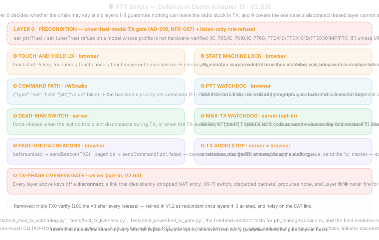

# 15. PTT Safety Architecture (ART 0535)

> **Principle**: Release is more safety-critical than keying. A lost PTT release command can leave a radio transmitting indefinitely — causing harmful interference, overheating the radio, and violating spectrum regulations. Every layer must have an independent path to force RX.

## 15.1 Safety Model — Defense in Depth

The MRRC Modern PTT safety architecture provides **7 independent layers of defense** against stuck-TX scenarios for all supported radio backends, preceded by a configuration precondition (Layer 0) that decides whether the chain may key the radio at all.

| Layer | Location | Mechanism | Failure Mode Caught |
|-------|----------|-----------|---------------------|
| 0 | Server (backend, precondition) | Unverified-model transmit gate: `set_ptt(True)`/`set_tune(True)` refuse unless `MRRC_ALLOW_UNVERIFIED_TX=1`; PTT releases are never gated | Keying a radio whose CAT semantics are documentation-derived rather than measured (AD-019) |
| 1 | Browser UX | Touch-and-hold: release on `mouseup`/`touchend`/`mouseleave`/`touchcancel` | User intentionally releasing PTT |
| 2 | Browser → Server | `sendCommand('ptt', false)` over `/WSradio` | Normal network path |
| 3 | Browser | PTT Watchdog: 500ms interval checks `radioState.tx_status`; up to 3 retries | TX0 command or state broadcast lost |
| 4 | Server | Dead-man switch: force `TX0;` when the last control client disconnects during TX, or when the TX-audio owner disconnects during TX. Uplink ownership follows the PTT-ing client (token-matched on key-up), a same-session replacement audio socket supersedes a half-open page-reload socket, and a different session cannot steal merely by connecting; owner disconnect promotes a remaining client | Browser crash, tab close, network loss, audio socket drop, multi-client ownership |
| 5 | Browser | `beforeunload` → `navigator.sendBeacon()` with TX0 | Tab/browser close during TX |
| 6 | Browser | `pagehide` → `sendCommand('ptt', false)` | Mobile app switch / backgrounding |
| 7 | Server + Browser | Stop TX audio stream; clear audio queue; `wsAudioTX.send('s:')` | Audio continuing to feed radio after release |
| 8 | Server | One-shot CQ call (AD-020): server-side player keys, plays the packaged recording once, then drains and unkeys (`stop_tx(graceful=True)` → `set_ptt(False)`). Aborts immediately on `cq:false`, initiator disconnect, last-client disconnect, external unkey (watchdog/TUNE), or shutdown | Automated transmission with no operator finger on PTT — every call has a definite end |

**Removed layer — Triple TX0 Verify (removed in V1.2, 2026-07-08):** earlier releases queried `TX;` three times at 200ms intervals after every release and re-sent `TX0;` on non-zero. This added ~600ms to every release, and field observation showed the radio obeys `TX0;` on the first write (fire-and-forget). Stuck-keyup detection is now covered by the server-side TX-status poll (500ms) feeding the browser PTT watchdog (Layer 3).



## 15.2 Layer Details

**Layer 0 (V2.41, extended V2.46): unverified-model transmit gate.** Before any of the layers below can key the radio, the active backend's `set_ptt(True)`/`set_tune(True)` refuse when the model profile is not hardware-verified (`IC7300Backend` for IC-705/IC-7610/IC-7760, `YaesuBackend` for FTDX10/FTDX101D/FTDX101MP/FTX-1F) unless `MRRC_ALLOW_UNVERIFIED_TX=1` is set; the refusal is logged once per process and PTT **releases are never gated**, so the layers below can always unkey. See AD-019.

### Layer 1: Touch-and-Hold UX

PTT only transmits while the user is actively touching the PTT button:

```javascript
pttBtn.addEventListener('mousedown', handlePTTStart);
pttBtn.addEventListener('touchstart', function(e) { e.preventDefault(); handlePTTStart(); });
pttBtn.addEventListener('mouseup', handlePTTEnd);
pttBtn.addEventListener('touchend', function(e) { e.preventDefault(); handlePTTEnd(); });
pttBtn.addEventListener('mouseleave', handlePTTEnd);
pttBtn.addEventListener('touchcancel', handlePTTEnd);
```

### Layer 2: Normal WebSocket Command

```javascript
function handlePTTEnd() {
    sendCommand('ptt', false);
    // ...
}
```

Server receives `{"type":"set","field":"ptt","value":false}` → sends the backend-specific PTT unkey command (FT-710 CAT `TX0;`, IC-7300/MK2 CI-V 0x1C 0x00 unkey) fire-and-forget (see removal note in §15.1).

### Layer 3: PTT Watchdog (Browser)

```javascript
// ptt_manager.js
pttVerifyTimer = setInterval(function() {
    if (!pttActive && !tuneActive) {
        if (radioState.tx_status !== 0) {
            retries++;
            sendCommand('ptt', false);
            if (retries >= 3) {
                // Force locally
                radioState.tx_status = 0;
                radioState.is_transmitting = false;
                renderPTTState();
                renderStatusBar();
                stopPTTWatchdog();
            }
        } else {
            stopPTTWatchdog();
        }
    }
}, 500);
```

The watchdog's input is the server-side TX-status poll (500ms), which keeps `radioState.tx_status` fresh even if the release command's state update was lost. The same ownership/dead-man logic applies to the IC-7300/MK2 backend, where PTT key/unkey is sent as CI-V 0x1C 0x00 frames.

**Cross-client false positive (fixed 2026-09-25, SDD I6 PTT half):** the watchdog cannot tell "my release did not land" from "another client just keyed" — with two tabs open, the idle tab's watchdog re-sent `ptt:false` on the *other* tab's key-up and unkeyed the live transmission (field log: 75 TX sessions in 5 minutes, 16 with zero mic frames, three releases 30 ms apart). Two layers now stop this: the server ignores a release from any socket that is not the current keyer (`_ptt_key_ws`, Layer 4b) and pushes the authoritative `tx_status` back with `ptt_keyed_by_other: true`; on that flag the browser calls `PTTManager.cancelWatchdog()` and stands down instead of retrying.

### Layer 4: Dead-Man Switch (Server)

```python
# In /WSradio disconnect handler:
if not ctrl_clients and radio.is_transmitting and backend and backend.connected:
    logger.warning("Last client disconnected during TX! Forcing RX.")
    await backend.set_ptt(False)
    radio.update(tx_status=0)
    if audio:
        audio.stop_tx()
```

**ATR1000 tune assist (server-side TX2 keying):** the optional ATR tune assist (`_atr_tune_assist()`, §9.8) keys a TX2 carrier server-side for up to 45 s (ATR_TUNE deadline). Safety: the carrier drop is guaranteed by a `finally` block on every exit path (skip/success/rollback/error); the Layer 4 last-client-disconnect dead-man switch still applies while the carrier is up; an SWR≤1.6 gate skips tuning entirely; relays roll back when SWR does not improve. All ATR I/O runs in its own asyncio task — never on the audio path.

### Layer 4b: Control-Plane PTT Arbitration (Server)

The TX-audio uplink has had a single owner since V2.4x; the **control plane** did not — any full-control client could send `ptt:false` at any time (last-writer-wins, SDD I6). Since 2026-09-25 the socket that sends `ptt:true` is recorded as `_ptt_key_ws`, and while it holds the key:

```python
# /WSradio "set ptt" handler:
if not _ptt_release_allowed(ws):        # ws is not the keyer
    # ignore the release, push the authoritative state back:
    await ws.send_text(json.dumps({
        "type": "stateUpdate",
        "fields": {"tx_status": radio.tx_status},
        "dirty": ["tx_status"],
        "ptt_keyed_by_other": True,     # browser watchdog stands down
    }))
    return
```

- A key-up from any client is still honored (takeover by re-keying), and the keyer's own release always passes — the stuck-keyup retry path (Layer 3) is untouched.
- `_ptt_key_ws` is cleared on every server-initiated unkey: normal release, audio-open-failure unkey, `MRRC_PTT_MAX_TX_SECONDS` watchdog, /WSaudioTX owner-disconnect force-RX.
- **Zombie keyer:** when the keying control socket disconnects mid-TX the server forces RX immediately — even with other clients still connected (they are not the keyer, and their releases are exactly what the arbitration ignores). Mirrors the /WSaudioTX owner rule.
- Trade-off: while a keyer is connected but unresponsive (browser frozen, socket alive), other clients cannot unkey it; the coverage is the keyer-disconnect rule, the Layer 4 dead-man, and the opt-in `MRRC_PTT_MAX_TX_SECONDS` watchdog.
- Tests: `PTTControlArbitrationTests` (tests/test_server_ws_protocol.py).

**ATR1000 auto full tune (no self-keying):** the high-SWR guard (`atr1000_client.py`, §9.8 behaviour 4) never keys the radio — it only acts while the operator is already transmitting (measured power ≥5 W) and emits nothing but an ATR-1000 tune frame; `atr1000_client.py` holds no CAT/PTT reference at all (a source-level test pins this). The manual assist's TX2 carrier path above is unchanged and remains the only ATR-initiated keying, with its `finally` drop rule.

### Layer 5: Beforeunload Beacon

```javascript
window.addEventListener('beforeunload', function() {
    if (pttActive || tuneActive) {
        if (navigator.sendBeacon) {
            const blob = new Blob([
                JSON.stringify({type:'set', field:'ptt', value:false})
            ], {type: 'application/json'});
            navigator.sendBeacon('/WSradio', blob);
        }
    }
});
```

### Layer 6: Pagehide Handler

```javascript
window.addEventListener('pagehide', function() {
    if (pttActive || tuneActive) {
        sendCommand('ptt', false);
    }
});
```

### Layer 7: TX Audio Stream Stop

Server-side on PTT release:
```python
if audio:
    audio.stop_tx()
```

Browser-side on PTT release:
```javascript
function stopTXAudio() {
    txAudioRunning = false;
    // ...
    if (wsAudioTX && wsAudioTX.readyState === WebSocket.OPEN) {
        wsAudioTX.send('s:');  // Flush server TX queue
    }
}
```

### Layer 8: Server-Side CQ Call (AD-020)

The CQ key transmits without a human holding PTT, so it is the one path where
"the operator lets go" cannot be the safety net.  Instead the *player* is the
safety net:

- The call is a single finite asset (<= 30 s guard) played once; the player
  knows the frame count, so `complete` is reached by arithmetic, not by a timer.
- While it runs, a manual key-up (PTT), a second CQ start, and TUNE are all
  refused — one carrier, one source.
- Any external release of the carrier (`MRRC_PTT_MAX_TX_SECONDS` watchdog,
  TUNE, another client, dead-man switch) is observed through
  `radio.is_transmitting` and ends the call as `aborted`/`unkeyed`.
- The initiator's disconnect aborts immediately (`reason:"client_gone"`),
  never leaving a bystander's carrier on the air.
- `cq:false` cuts the tail (no graceful drain) because the operator asked to
  stop *now*; a natural end drains gracefully so the last syllable is not
  chopped.

## 15.3 Safety Flow Diagram

```text
Normal Release Path:
  PTT Button Release (any trigger)
    → handlePTTEnd()
      → sendCommand('ptt', false)          [Layers 1+2]
      → stopTXAudio() + wsAudioTX.send('s:') [Layer 7]
      → Server: backend-specific PTT unkey command (fire-and-forget)
      → Server: TX-status poll (500ms) tracks RX
      → PTT Watchdog starts                 [Layer 3]

Emergency Paths:
  Browser crash / tab close:
    → beforeunload → sendBeacon PTT=false;  [Layer 5]
    → pagehide → sendCommand PTT=false;     [Layer 6]
    → WS disconnect → server dead-man switch [Layer 4]
    → Server stops TX audio                 [Layer 7]

  Network loss during TX:
    → WS disconnect → server dead-man switch [Layer 4]
    → Server stops TX audio                 [Layer 7]
    → Radio returns to RX (protocol timeout)
```

## 15.4 Testing the Safety Layers

| Test | Expected Behavior | Layers Tested |
|------|-------------------|---------------|
| Normal PTT press/release | TX → RX within 200ms | 1, 2 |
| Force-close browser during TX | Radio returns to RX | 4, 5, 6 |
| Network packet loss during release | Browser watchdog re-sends `ptt=false` (state via 500ms TX-status poll) | 3 |
| Tab background on iOS during TX | pagehide sends TX0 | 6 |
| Multiple rapid PTT toggles | Each release properly processed | All |
| Pull USB cable during TX | No software path can reach the radio; server marks CAT disconnected and forces RX state on reconnect | — (hardware) |
| Server kill -9 during TX | Radio returns to RX (CAT timeout, no polling) | Hardware |

## 15.5 Safety Design Principles

1. **Release is more important than keying.** Every release path must work even if the keying path is broken.
2. **No single point of failure.** 7 independent layers catch different failure modes.
3. **Fail safe, not fail dangerous.** If in doubt, force RX.
4. **Server has final authority.** Even if the browser is completely gone, the server forces RX (Layer 4).
5. **Verify, don't assume.** TX state is read back continuously via the 500ms TX-status poll, and the browser watchdog acts on any stuck-TX indication (Layer 3). The per-release triple readback was removed in V1.2 — see §15.1.
6. **Stop audio before RF.** Audio stream stops before the RF carrier drops, preventing hot-switching noise.

## 15.6 Hub-mode extension (planned, NOT implemented)

> V2.62 由 `mrrc_hub`（MRRC Cloud Hub）SDD V0.1 的评审引入，记录一个原先未覆盖的失效模式；
> **V2.63 已实现（opt-in）**，见本节末的"实现"段。设计细节见
> `mrrc_hub/SDD/15-ptt-safety-hub-mode.md`（AD-H06 的来源），两侧以 V1–V10 注入矩阵对齐。

**缺口**：Layer 4 的 dead-man switch **只在 WebSocket 真正断开时触发**。源码注释（`server.py`）已明确：

> `Opt-in stuck-keyup watchdog (MRRC_PTT_MAX_TX_SECONDS, 0 = off). Covers clients that hang WITHOUT
> disconnecting — the dead-man switch and client watchdogs never fire for a zombie-but-connected socket.`

且该兜底默认关闭（`config.py`：`_env_float("MRRC_PTT_MAX_TX_SECONDS", 0.0)`，检查粒度 1.0 s）。因此：

| 失效模式 | 当前是否有本地释放路径 |
|---|---|
| 关闭浏览器 / 进程退出 / TCP RST | ✅ Layer 4（立即） |
| **拔网线 / 换 Wi-Fi / NAT 掉表 / 静默丢弃（`iptables DROP`）** | ❌ **无** —— TCP 未断，Layer 4 与 Layer 3 都不触发 |
| 进程卡死但仍连着 | ⚠️ 仅当 `MRRC_PTT_MAX_TX_SECONDS` 非零（默认 off） |

在 LAN 场景这不致命（断线 ≈ 真断线）。但在**经 Hub 的远程接入**场景（运营商 NAT、双层 NAT、
弱网、频繁换网）中，半开连接是**主路径**而非边缘；此刻租约仍在、云端 TTL 未到期 —— 即"释放
依赖云端"，而这正是远程接入设计明令禁止的。

**实现（V2.63，opt-in）**：`MRRC_REMOTE_SESSION_TX_HEARTBEAT_S`（默认 `0` = 关闭）→ 服务端
`_tx_liveness_timeout()` + `_tx_liveness_watchdog()`（tick 0.25 s，检测延迟 ≤ 阈值 + 1 tick）；浏览器在
PTT/TUNE 期间每 500 ms 发 `{type:"txhb"}`（`ptt_manager.js`，起于 pttStart/tuneStart，止于
pttEnd/tuneEnd/forceRX）。三个不释放条件是**故意的负例**：①未声明能力的会话（旧原生客户端、自带 watchdog
的 LAN 客户端）永不被门控 —— 发 `txhb` 本身就是能力声明；②只有**持键会话**超时才释放，陈旧 Listener
不得掐掉别人的载波（Layer 4 仲裁）；③刚连上就按键、还没发过心跳的会话不算超时。释放走既有
fire-and-forget 路径（单次 `set_ptt(False)` + 清零 TX 表 + 告知控制面），无 verify 循环。
`tests/test_tx_liveness.py` 21 项覆盖上述每一条（含"单包丢失不释放"与"陈旧 Listener 不释放"）。

**原计划轮廓（保留作设计对照）**：

| 项 | 设计 |
|---|---|
| 新增配置 | `MRRC_REMOTE_SESSION_TX_HEARTBEAT_S`（默认 1.0 s，0 = 关闭） |
| 新层 | **远程会话活性层**：TX 期间会话心跳缺失 ≥1.0 s → `set_ptt(False)` + 清 TX 音频队列 |
| 心跳节奏 | TX 期间 500 ms；隧道层连续 2 次未达（≈1.0 s）主动关流并通知（**不发 TX0**） |
| 仲裁 | **必须复用 Layer 4 的 key-owner 仲裁**（`_ptt_key_ws` / `_ptt_release_allowed`）：不得释放**别人**的载波（例如 LAN 客户端正在发射时，远端 Listener 的半开不得导致释放） |
| 时限 | EOF 型 ≤ 1 s（现状已满足）；**半开型 ≤ 1.5 s**（新增） |
| 兜底 | Hub 模式建议 `MRRC_PTT_MAX_TX_SECONDS=120` —— 语义是"最长连续发射上限"，**不是**释放机制 |
| 验证 | `mrrc_hub/SDD/15-ptt-safety-hub-mode.md` §15.5 的 V1–V10 注入矩阵（含 V8 LAN 载波不被误释放、V10 单包丢失不误释放） |

**术语订正**：对外文档长期写作"七层 PTT 安全释放"，本章实为 **Layer 0（前置闸门）+ Layer 1–8**
（Layer 0 于 V2.41 引入、V2.46 扩展；Layer 8 为 V2.49 的一次性 CQ 播放器）。以本章为准。
