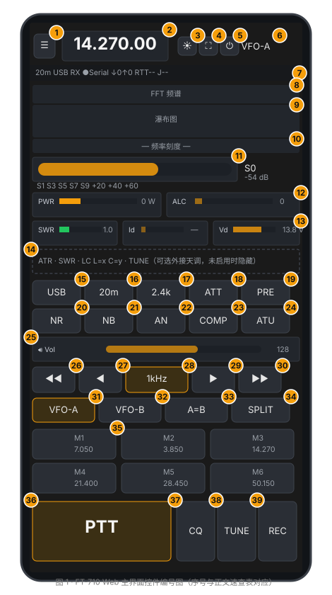
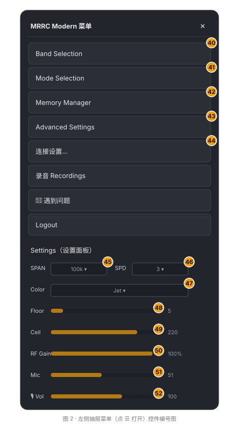

# MRRC Web 遥控 — 操作指南

> 适用于 MRRC Web Control（v1.9.x，2026-08 之后的界面），支持 FT-710、IC-7300 与 IC-7300MK2。本文档逐项说明界面上每一个按钮、滑杆、下拉框的功能与用法，编号与文末插图（图 1 主界面、图 2 菜单）中的琥珀色序号一一对应。

---

## 0. 开始之前：连接与登录

| 步骤 | 说明 |
|------|------|
| 1. 启动服务 | 在电台电脑上运行 `python server.py`（或 Windows 安装版/桌面启动器），服务默认监听 `0.0.0.0:8888`，HTTPS 优先（首次运行自动生成自签名证书）。 |
| 2. 打开页面 | 手机/电脑浏览器访问 `https://<服务器IP>:8888`（局域网）或 `http://localhost:8888`（本机）。iPhone 上建议用 Safari 并「添加到主屏幕」以获得 PWA 全屏体验。 |
| 3. 登录 | 输入共享密码（服务启动时由 `FT710_WEB_PASSWORD` 或安装向导设置），点 **Login**。成功后在 `ft710_auth` Cookie（30 天有效）；密码错误返回 401，5 分钟内连续 5 次失败会触发 429 限流，需等待后再试。 |
| 4. 建立连接 | 手机端：点顶栏 **⏻** 开始连接（见控件 5）；桌面端打开页面后自动连接。状态栏 ●Serial 变绿表示与电台的 CAT 串口已连通。 |

> ⚠️ 电台硬件电源开关**不在**本界面内——⏻ 只控制浏览器与服务器的 Web 连接，不控制电台电源（V2.13 已撤回电台电源软开关功能）。

---

## 0.5 电台型号差异

服务器通过 `MRRC_RADIO_MODEL`（`ft710`、`ic7300`、`ic7300mk2`）选择后端，前端会根据后端上报的 `capabilities` 自动调整可用控件。

| 功能 | FT-710 | IC-7300 / IC-7300MK2 |
|------|--------|---------------------|
| 串口协议 | Yaesu CAT，38400 baud | Icom CI-V，115200 8N1，默认地址 `0x94` |
| 频谱来源 | FT4222 SPI（或 S-meter 回退） | CI-V `0x27` 帧（或 S-meter 回退） |
| USB 音频 | 44.1 kHz，需重采样到 48 kHz | 48 kHz，无需重采样 |
| AN（自动陷波） | 有 | **无**，界面隐藏 |
| Vd / Id 仪表 | 有 | **无**，界面隐藏 |
| 滤波器 | 多档语音/窄带宽度 | FIL1–FIL3 循环 |
| ATT | 0 / 6 / 12 / 18 dB | 开/关 |
| VFO-B 直接选择 | 有 | 无 |
| 内置天调 | 无（可外接 ATR1000） | 有 |
| 70 MHz | 无 | 视地区版本而定 |
| 发射时频谱 | 暂停并显示「频谱暂停」 | 继续显示（CI-V 频谱不受发射影响） |

---

## 1. 主界面控件编号图

**图 1** 为主界面（手机竖屏布局，桌面端宽度放大但控件一致）。琥珀色圆点为控件序号，与第 3 节速查表对应。

**图 2** 为点顶栏 ☰ 后滑出的左侧抽屉菜单。

---

## 2. 控件速查表（编号 → 名称 → 功能 → 操作）

### 2.1 顶栏（图 1 序号 1–7）

| # | 控件 | 功能 | 操作 |
|---|------|------|------|
| 1 | ☰ 菜单 | 打开左侧抽屉菜单（波段/模式/记忆/设置/退出） | 单击 |
| 2 | 频率显示 | 显示当前 VFO 的频率（7 位：MHz.kHz.Hz 十位） | **单击**切换为输入框，直接键入 MHz（如 `14.270`）或 kHz（如 `14270`）后回车生效；`Esc` 取消 |
| 3 | ☀ 屏幕常亮 | 屏幕唤醒锁（Wake Lock），防止操作中熄屏；浏览器不支持时自动降级为每 30 秒模拟点按的兜底方案 | 单击开关；**首次任意触摸页面会自动开启** |
| 4 | ⛶ 全屏 | 浏览器全屏/退出全屏（沉浸式操作） | 单击切换 |
| 5 | ⏻ 连接开关 | 启动 / 停止 Web 客户端连接（4 路 WebSocket：控制/收音频/发音频/频谱）。**不是电台电源开关** | 单击：断开时点击开始连接，连接中点击断开并停止自动重连 |
| 6 | VFO-A / VFO-B | 当前活动 VFO 指示（琥珀色高亮 = 活动 VFO） | 只读指示；切换活动 VFO 用序号 31/32 按钮 |
| 7 | 状态栏 | 一行显示：当前波段（如 `20m`）、模式（如 `USB`）、收/发状态（`RX`/`TX`/`TUNE`，发射时变红）、串口连接点（绿=已连接）、⚠`无声`告警（RX 音频持续 20 秒全零，电台 USB 音频可能卡死）、实时码率 `↓↑`（下行/上行 kbps）、`RTT` 往返延迟与 `J` 抖动（ms） | 只读；其中 `无声` 告警出现时应检查电台 USB 连接或重启电台 |

### 2.2 频谱区（序号 8–10）

| # | 控件 | 功能 | 操作 |
|---|------|------|------|
| 8 | FFT 频谱折线 | 实时幅度-频率折线（青绿色），叠加频率刻度 | **单击**：把当前 VFO 直接 QSY 到点击位置对应的频率（位移 ≤8px 才算点击，滑动不触发） |
| 9 | 瀑布图 | 频谱随时间滚动的热力图（颜色主题可在菜单调） | 同上，单击跳频；发射（TX/TUNE）期间瀑布暂停并显示「频谱暂停」 |
| 10 | 频率刻度 | 以当前 VFO 为中心的频率标尺（跨度由菜单 SPAN 决定） | 只读 |

> 点击 8/9 实现「指哪打哪」跳频；按住拖动则是页面滚动，不会误触发。

### 2.3 仪表区（序号 11–14）

| # | 控件 | 功能 | 操作 |
|---|------|------|------|
| 11 | S 表 | 信号强度表：S1–S9+60 渐变刻度 + 数值（`S0` 起）+ 相对电平（`S9 = 0 dB` 参考） | 只读（CAT `SM0` 或频谱帧数据） |
| 12 | PWR / ALC 表 | 发射功率（W）与 ALC 电平横向条 | 只读（CAT `RM`，0–255 原始值经分段线性标定） |
| 13 | SWR / Id / Vd 表 | 驻波比（SWR）、末级电流（A）、供电电压（V） | 只读；Id/Vd 仅在 TX 时有效，TX→RX 会清零。**IC-7300 不显示 Id/Vd** |
| 14 | ATR 行（可选） | 外接 ATR1000 网络天调的功率/SWR/LC 显示 + TUNE 调谐按钮 | 仅当服务端启用了 `FT710_ATR1000_HOST` 且天调在线时显示；否则整行隐藏。TUNE 按钮点击触发服务端调谐辅助（SWR≤1.6 自动跳过，成功后记忆 LC 值） |

### 2.4 快捷控制区（序号 15–19）

| # | 控件 | 功能 | 操作 |
|---|------|------|------|
| 15 | 模式按钮（如 `USB`） | 循环切换模式。FT-710：LSB → USB → CW-U → AM → FM → RTTY-L → DATA-L；IC-7300：依后端模式表 | 单击循环；需要精确选择时用菜单 → Mode Selection（序号 40） |
| 16 | 波段按钮（如 `20m`） | 循环切换业余波段；切换后频率跳到该波段默认频率并自动选 VFO-A。FT-710 含 4m；IC-7300 可能含 70 MHz（视地区） | 单击循环；菜单 → Band Selection（序号 39）可精确选 |
| 17 | 滤波按钮（如 `2.4k`） | 循环切换滤波宽度。FT-710：多档语音/窄带宽度；IC-7300：FIL1 → FIL2 → FIL3 | 单击循环 |
| 18 | ATT 衰减 | 射频衰减器。FT-710：0 / 6 / 12 / 18 dB；IC-7300：开/关 | 单击循环 |
| 19 | PRE 前置放大 | 前置放大器。FT-710：3 档；IC-7300：依后端支持 | 单击循环 |

### 2.5 DSP 开关区（序号 20–24）

| # | 控件 | 功能 | 操作 |
|---|------|------|------|
| 20 | NR | 数字降噪（DNR，电台硬件 DSP）开关 | 单击开/关，开启时按钮琥珀色高亮 |
| 21 | NB | 噪声抑制（DBF 类脉冲抑制）开关 | 单击开/关 |
| 22 | AN | 自动陷波（Auto Notch）开关。**IC-7300 无此功能，按钮隐藏** | 单击开/关 |
| 23 | COMP | 语音压缩器开关（CAT `PR00`/`PR01`） | 单击开/关 |
| 24 | ATU | 内置天调开关（`AC000`/`AC001`） | 单击开/关 |

> NR/NB 的**强度**滑杆（NR Level 1–15、NB Level 0–10）保留在 DOM 中但默认隐藏（移动端空间不足）；如需调节可在浏览器开发者工具中显示或留待后续版本。

### 2.6 音量滑杆（序号 25）

| # | 控件 | 功能 | 操作 |
|---|------|------|------|
| 25 | 🔊 Vol | **浏览器端** RX 播放音量（0–255，带 10 倍增益补偿电台 USB 音频偏小的问题）。注意它**不是**电台 CAT 的 AF 增益——两者刻意解耦，轮询不会覆盖你的设置 | 拖动实时生效，松手保持；值存入 Cookie（`ft710_afVol`）。发射（TX/TUNE）期间接收增益自动静音（消自监听回音），松 PTT 后恢复 |

> 电台侧的 AF 增益（AF Gain）不受本滑杆控制；需要调电台面板音量时请用实体旋钮。

### 2.7 调谐区（序号 26–30）

| # | 控件 | 功能 | 操作 |
|---|------|------|------|
| 26 | ◀◀ | 频率下移 **5×当前步进**（快退） | 单击 |
| 27 | ◀ | 频率下移 **1×当前步进** | 单击 |
| 28 | 步进按钮（`1kHz`） | 循环切换调谐步进：10Hz → 100Hz → 1kHz → 5kHz → 10kHz → 25kHz，按钮文本实时显示 | 单击 |
| 29 | ▶ | 频率上移 **1×当前步进** | 单击 |
| 30 | ▶▶ | 频率上移 **5×当前步进**（快进） | 单击 |

> 调谐作用于**活动 VFO**（VFO-A 或 VFO-B，见序号 31/32）。

### 2.8 VFO 区（序号 31–34）

| # | 控件 | 功能 | 操作 |
|---|------|------|------|
| 31 | VFO-A | 选 VFO-A 为活动 VFO（频率显示/调谐/PTT 均以它为准） | 单击（已是活动态时忽略） |
| 32 | VFO-B | 选 VFO-B 为活动 VFO | 单击 |
| 33 | A=B | 把 VFO-B 的频率复制到 VFO-A（电台 `A=B` 语义：A 变 B） | 单击 |
| 34 | SPLIT | 收发异频（Split）开关：发射用 VFO-A、接收用 VFO-B（或反之，依电台设定） | 单击开/关，开启时按钮高亮 |

### 2.9 记忆频道（序号 35）

| # | 控件 | 功能 | 操作 |
|---|------|------|------|
| 35 | M1–M6 | 6 个记忆槽，每格显示编号 + 频率（MHz） | **单击**：调出该频道（频率+模式，写入当前活动 VFO）；**长按 0.8 秒**：把当前活动 VFO 的频率+模式保存到该槽（带震动反馈），同时写入服务端 `mem_channels.json` 与本机 Cookie |

> 频道编辑/清空：菜单 → Memory Manager（序号 41）里对每个槽点 **Clear** 清空。频道数据由服务端持久化，换浏览器也能读到（Cookie 只做首屏快速回显）。

### 2.10 底部 PTT 区（序号 36–38）

| # | 控件 | 功能 | 操作 |
|---|------|------|------|
| 36 | PTT | 按下发射（载波 + 语音），松开停止 | **按住发射、松开停止**（触摸按住/鼠标按住均可）；发射期间按钮变红。内置三重保险：①500ms 客户端看门狗（卡死自动松开发射）②页面关闭/断线的死手开关（服务端强制 `TX0`）③发射期间滑出页面也会自动释放 |
| 37 | TUNE | 发射调谐载波（用于天调/驻波调整），仅按住期间发射 | **长按**：按住出载波，松开即停（无自锁，防止误触长发射）。发射期间频谱暂停显示 |
| 38 | REC | 把 **RX 接收到的音频**录成 MP3 文件（128 kbps，48 kHz 单声道） | 单击开始/再单击停止；停止时浏览器自动下载 `.mp3`。首次点击会现场加载约 500KB 的 MP3 编码器（`lame.js`），加载失败会提示「MP3 编码器加载失败」 |

> PTT 键盘快捷键：桌面端按 **空格键** 等效于按住/松开 PTT（详见第 4 节）。

### 2.11 抽屉菜单（图 2 序号 39–51）

| # | 控件 | 功能 | 操作 |
|---|------|------|------|
| 39 | Band Selection | 弹窗列出全部 12 个波段（含频率范围），精确选段 | 单击波段项；选中后跳到该波段默认频率 |
| 40 | Mode Selection | 弹窗列出 7 种模式精确选择 | 单击模式项 |
| 41 | Memory Manager | 弹窗列出 M1–M6 的当前内容，可逐个 **Clear** 清空 | 单击 Clear / Close |
| 42 | Advanced Settings | 平滑滚动回 DSP 控制面板区（快捷定位） | 单击 |
| 43 | Logout | 退出登录：调 `/api/auth/logout` 作废会话并跳回登录页 | 单击 |
| 44 | SPAN 下拉 | 频谱显示跨度：10k/20k/50k/100k/200k/500k/1M（Hz），即瀑布图横轴宽度 | 选择后立即下发电台（`scope_span`）并重绘频谱 |
| 45 | SPD 下拉 | 频谱刷新速度档 1–5（电台 `EX` scope speed） | 选择后立即下发 |
| 46 | Color 下拉 | 瀑布图配色主题：Jet / Hot / Cold / Thermal / Night / Gray | 选择后本地生效并存入 Cookie（`scopeTheme`） |
| 47 | Floor 滑杆 | 瀑布图噪声底限（0–200）：低于该值显示为背景色，值越高背景越黑、弱信号越不可见 | 拖动实时预览，松手存 Cookie |
| 48 | Ceil 滑杆 | 瀑布图信号上限（50–255）：决定满刻度对应的信号强度，值越低强信号越早饱和变色 | 拖动实时预览，松手存 Cookie |
| 49 | RF Gain 滑杆 | 电台射频增益（CAT `RG` 0–255 映射为 0–100%）：调低可防强信号过载削波 | 拖动实时显示，**松手生效**下发电台 |
| 50 | Mic 滑杆 | 电台侧麦克风增益（CAT `MIC`/`MG`，0–100）：控制 TX 语音进入电台的输入电平 | 松手生效并写入 Cookie；每次重连后若与电台实际值不同会自动回推 |
| 51 | 🎙 Vol 滑杆 | **浏览器端**麦克风软件增益（0–200 → 线性 0–2×，100 = 原声）：在采集后、编码前放大，与电台侧 Mic 相互独立 | 拖动实时生效（作用于麦克风 GainNode），值存 Cookie |

> 菜单底部显示版本号 `FT-710 v1.0`（前端资源版本，非电台固件版本）。

---

## 3. 键盘快捷键（桌面端）

| 按键 | 功能 |
|------|------|
| 空格（Space） | 按下 = 发射（PTT 开始），松开 = 停止发射 |
| ← / → | 频率下移 / 上移 1×当前步进 |
| ↑ / ↓ | 频率上移 / 下移 5×当前步进（快调） |
| 回车（在频率输入框内） | 提交输入的频率 |
| Esc（在频率输入框内） | 取消编辑 |

> 安全细节：键盘事件忽略长按自动重复（`e.repeat`），也不在输入框内触发 PTT/调谐，避免打字时误发射。

---

## 4. 安全须知（请先阅读）

1. **PTT 是「按住才发射」**，没有任何自锁模式；松开即停。若页面或浏览器崩溃，服务端死手开关会在最后一个客户端断开时自动强制释放发射（`TX0`）。
2. **TUNE 同理**，长按出载波、松手即停——调谐时请确认天线已接好、SWR 正常，长时间发射前建议先用小功率。
3. 发射期间**频谱暂停**（FT-710 电台会干扰频谱数据流），瀑布图显示「TX 发射中 — 频谱暂停」是正常现象。IC-7300 使用 CI-V `0x27` 频谱，发射期间通常继续刷新。
4. **无声（🔇）告警**：状态栏出现红色「无声」表示 RX 音频流 20 秒全零——电台 USB 音频接口可能卡死，请重启电台或重插 USB 线。
5. 多人共用时，PTT 所有权按「最后按下者 + 同一登录令牌」仲裁（V2.1 修复）：别在别人发射时抢按。
6. 无线局域网内建议使用 HTTPS（自签名证书首次会有浏览器警告，属于预期行为）；`http://` 明文下浏览器会禁用麦克风与音频工作线程（AudioWorklet），iPhone 上尤其如此。

---

## 5. 常见问题（FAQ）

| 问题 | 解答 |
|------|------|
| 页面打开一直停在登录页 | 检查密码；若提示 429，等 5 分钟限流窗口结束。 |
| 状态栏 ●Serial 是红色/灰点 | CAT 串口未连通：检查 USB 线、串口号（`FT710_SERIAL_PORT`）、电台是否开机。 |
| 点击 ⏻ 后没声音 | 检查浏览器麦克风/扬声器权限（HTTPS 下才允许）；确认电脑选择了电台的 USB 音频设备。 |
| 瀑布图不动 | 发射期间属正常；接收时不动请检查 FT4222 驱动与 `FT710_FTDI_LIB_DIR` 配置，或查看是否触发「无声」告警。 |
| 记忆频道丢了 | 服务端文件是 `mem_channels.json`（随服务保存）；浏览器本地 Cookie 只作首屏回显。 |
| 录音文件在哪 | 点 REC 开始、再点 REC 停止后浏览器自动下载生成的 `.mp3`。 |
| 发射时听到自己声音 | 这是自监听回音，正常；接收音量在 TX 期间自动静音，松 PTT 后恢复。 |

---

## 附：界面元素与后台命令对照（供高级用户/排障）

| 界面元素 | 后台命令/通道 |
|----------|--------------|
| 模式按钮 | `MD` / `MD0`（模式查询与设置） |
| 波段按钮 | `BS`（波段选择，服务端 `band` 命令） |
| 滤波按钮 | `SH` / `SH0`（滤波宽度，读回实际索引） |
| ATT / PRE | `RA0`–`RA3` / `PA0`–`PA2` |
| NR / NB / AN / COMP | `NR1/0`、`NB1/0`、`AN1/0`、`PR01/PR00` |
| ATU | `AC001`（开）/ `AC000`（关）；调谐 `TX2`+`AC003` |
| RF Gain | `RG`（0–255） |
| Mic | `MIC`/`MG`（0–100，电台侧） |
| 频率显示/调谐 | `FA` / `FB` / `VS`（活动 VFO 跟踪） |
| S 表 | `SM0`（+ 频谱帧 S 值） |
| 多路仪表 | `RM3`–`RM8`（PWR/ALC/SWR/Id/Vd） |
| 记忆频道 | `/api/mem_channels`（GET/POST）+ `memRecall`/`memSave` WS 消息 |
| 频谱 | `/WSspectrum`（1701B 帧）+ 电台 `EX040101`/`EX040200`（scope 初始化） |
| 音频 | `/WSaudioRX`（下行 Opus 48k/PCM）、`/WSaudioTX`（上行 Opus 48k CBR 64kbps） |
| 天调（可选） | `/WSatr1000`（JSON）+ `FT710_ATR1000_HOST` 环境变量 |

---

*文档维护：与 `static/index.html`、`static/ft710_main.js`、`static/ft710_ui.js` 保持一致；界面改动后请同步本指南与编号图。*
